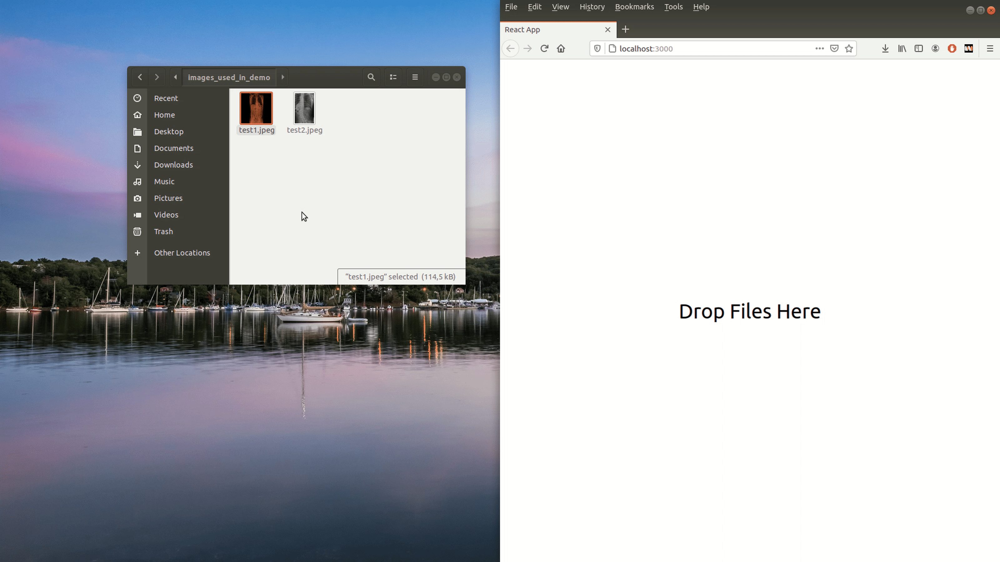
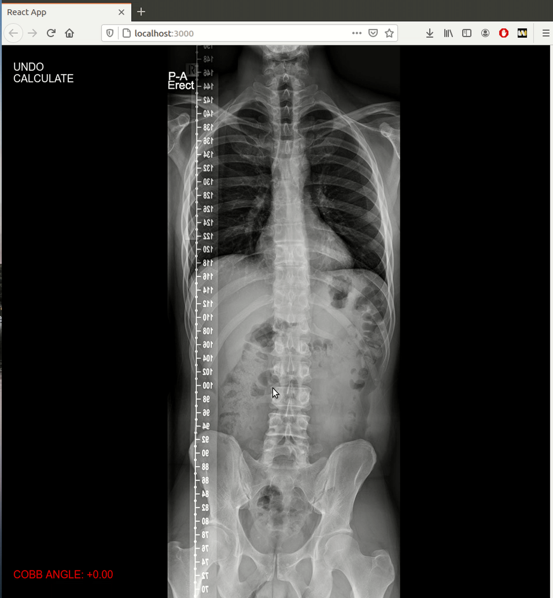

# A-SaaS-for-Cobb-Angle-Analysis

## About

Many radiologists have access to toolboxes where they can interactively mark Roentgen images
and make calculations for anomalies by default in their workstations, however those tools are
time consuming and lack intuitiveness. This project aims to reduce examination time and effort for doctors and provide an easily accessible solution.

> This is an early prototype of a SaaS, where a practitioner can just type the domain name to the browser, drags and drops the roentgen image and starts examination without any installation overhead.

## Automatic calculation

> The user, like in a regular workstation, can draw straight lines but does not
> need to calculate angles between them manually. Users can just choose as many potential
> endplates as they want and mark them with straight lines. The SaaS calculates all the angle combinations automatically and visualizes two lines (highlights them with red) of the detected Cobb Angle. The angle is then printed on the screen.
